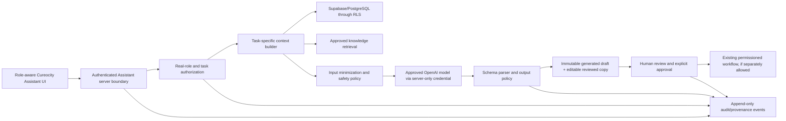

# Cureocity Assistant — All-Staff Product Requirements Document

| Field | Value |
| --- | --- |
| Document status | Proposed product specification; not approved for implementation or release |
| Version | 1.0 |
| Date | 17 August 2026 |
| Product owner | Cureocity Super Admin / designated product owner |
| Intended readers | Product, clinical leadership, operations, finance, HR, engineering, security, privacy, and quality reviewers |
| Target product | Cureocity Internal Management System |
| Environments | Isolated AWS Development first; Production only after role-specific gates pass |

## 1. Executive summary

Cureocity Assistant is a staff-only, role-aware conversational assistant embedded in the Cureocity Internal Management System. Its purpose is to reduce the time staff spend finding information, understanding queues, preparing drafts, and checking whether work is complete—without allowing an AI model to silently become an operator, clinician, approver, sender, or system administrator. “Cureocity Assistant” is the approved staff-facing product name; existing internal code, database, and audit identifiers may continue to use the legacy Copilot name until a safe compatibility migration is justified.

The product target is one consistent conversational experience whose capabilities change according to the signed-in staff member's real role, existing application permissions, current task, and approved data scope. A Dietitian should receive nutrition-workflow assistance; a Front Desk user should receive scheduling and onboarding assistance; a Finance user should receive reconciliation assistance; and a Super Admin should receive cross-functional operational summaries. The assistant must not flatten those roles into a single broad data-access profile.

The Assistant may answer, retrieve, summarize, compare, flag, and draft within an explicit role allowlist. In later phases it may prepare structured action proposals. It must not autonomously send communications, change records, alter access, approve clinical documents, make financial or HR decisions, or execute an external action. Any consequential proposal requires an authorized human to inspect the evidence, edit the proposed result, and confirm it through the application's normal permissioned workflow. Some actions remain human-only even after confirmation.

This PRD defines the ambitious end state and the staged controls required to reach it. It does not authorize AI configuration, data migration, feature enablement, or implementation.

## 2. Current product baseline versus future scope

### 2.1 What exists today

The repository currently establishes the following facts:

- A role-aware Cureocity Assistant shell recognizes 13 staff roles: Super Admin, Administrator, Manager, Medical Director, Front Desk, Doctor, Dietitian, Fitness Trainer, Health Coach, Psychologist, Finance, HR, and Staff.
- Client accounts are explicitly excluded from the staff Assistant route and must remain excluded.
- Authenticated staff pages now include a persistent Cureocity Assistant launcher. It opens an accessible side panel over the current page so the user's page state is preserved, and it links to a dedicated full workspace for longer work and draft history.
- The global panel invokes text generation only for an existing, enabled, server-guarded capability. The Super Admin quick-draft path uses the current guarded draft action; Health Coach work continues in the guarded client-scoped workspace; unapproved or unconfigured roles receive an explicit unavailable state.
- A visible voice-input affordance is present but disabled and labelled coming soon. It does not request microphone permission, record audio, create a transcript, or call a voice provider. Voice requires a separate privacy, consent, retention, provider, security, and evaluation decision.
- A shared versioned task-manifest foundation now defines real-role ownership, feature gates, execution mode, action tier, allowed/forbidden data, human review, and prohibited actions for every implemented task. A global emergency kill-switch contract can disable all task availability without broadening any role.
- The Health Coach pilot is functional in code but guarded. It has nine approved behavioural-coaching draft tasks and strict clinical hard stops. It is enabled only when its dedicated feature flag and server-side AI configuration are present.
- The Super Admin pilot is functional in code but disabled in the current AWS Development environment pending a Development-only OpenAI API key and `STAFF_COPILOT_SUPER_ADMIN_ENABLED=true`. Its four approved tasks are:
  1. draft an operational summary;
  2. flag overdue items;
  3. prepare a staff-access review draft; and
  4. suggest operational follow-ups.
- Super Admin context is currently reduced to aggregate or anonymized operational information. The model does not receive raw database identifiers from that context builder.
- Super Admin outputs are structured, bounded, safety-checked, stored as reviewable drafts, and may be marked Accepted or Discarded. Acceptance stores working text only; it executes no operational action.
- Generation, blocked generation, acceptance, and discard behavior has an audit path. Existing draft evidence is designed to be immutable, and no delete path is exposed for discarded Super Admin drafts.
- The first Phase 3 Staff slice is implemented in code as a deterministic navigation-checklist pilot. It uses only versioned public application-route metadata, performs no AI call, reads no client/staff/business record, stores immutable generated evidence plus separately reviewed text through an atomic audit RPC, and remains default-off pending migration 0186 and its dedicated Development feature flag.
- The first Front Desk slice is implemented in code as a deterministic operational-navigation checklist for lead intake, client onboarding, appointment coordination, and follow-up/retention routes. It accepts only an allowlisted workflow key, performs no AI call or application-record read, cannot be edited with record details, and remains default-off pending migrations 0186/0187 and its dedicated Development feature flag.
- The first Fitness Trainer slice is implemented in code as a deterministic workspace checklist for Today/roster orientation, session coordination, workout-planning/library navigation, and summary/team-handoff navigation. It accepts only an allowlisted workflow key, performs no AI call or application-record read, cannot be edited with record details, and remains default-off pending migrations 0186/0188 and its dedicated Development feature flag.
- The first Administrator slice is implemented in code as a deterministic governance/navigation checklist for access governance, issue governance, service configuration review, and operational oversight. It accepts only an allowlisted workflow key, performs no AI call or application-record read, cannot be edited with record details, and remains default-off pending migrations 0186/0189 and its dedicated Development feature flag.
- The first Manager slice is implemented in code as a deterministic operations/navigation checklist for coverage coordination, coach-quality review orientation, onboarding handover, and service-operations review. It accepts only an allowlisted workflow key, performs no AI call or application-record read, cannot be edited with record details, and remains default-off pending migrations 0186/0190 and its dedicated Development feature flag.
- Every role other than Health Coach, Super Admin, Administrator, Manager, Front Desk, Fitness Trainer, and the bounded Staff navigation pilot is deliberately inert. A future-looking environment flag alone cannot activate one of those roles because its tasks and boundaries have not been approved or implemented.
- The existing application already has role gates, discipline ownership, row-level security (RLS), audit records, clinical review responsibilities, and human approval flows that the Assistant must reuse rather than bypass.

Relevant current sources are [the versioned task policy](../lib/cureocity-assistant-policy.ts), [the staff framework](../lib/staff-copilot.ts), [the global Assistant launcher](../components/CureocityAssistantLauncher.tsx), [the Staff navigation contract](../lib/staff-navigation-assistant.ts), [the Front Desk operational contract](../lib/front-desk-assistant.ts), [the Fitness Trainer operational contract](../lib/fitness-trainer-assistant.ts), [the Administrator governance contract](../lib/administrator-assistant.ts), [the Manager operations contract](../lib/manager-assistant.ts), [the Super Admin task definition](../lib/super-admin-copilot.ts), [the Health Coach task definition](../lib/coach-copilot.ts), [the full Assistant workspace](../app/(app)/copilot/page.tsx), [the shared Staff draft foundation](../supabase/0186_staff_assistant_policy_foundation.sql), [the Front Desk pilot migration](../supabase/0187_front_desk_assistant_pilot.sql), [the Fitness Trainer pilot migration](../supabase/0188_fitness_trainer_assistant_pilot.sql), [the Administrator pilot migration](../supabase/0189_administrator_assistant_pilot.sql), [the Manager pilot migration](../supabase/0190_manager_assistant_pilot.sql), and [the Super Admin draft migration](../supabase/0183_staff_copilot_drafts.sql).

### 2.2 Future scope defined by this PRD

This PRD adds a product definition—not an implementation—for:

- a conversational Assistant available to every authenticated staff role;
- role-specific task and data allowlists;
- evidence-linked answers and drafts;
- bounded conversation history and approved knowledge retrieval;
- a common proposal, approval, audit, and evaluation model;
- explicit clinical, finance, HR, privacy, and access-management safeguards; and
- a phased path from read-only assistance to carefully controlled, human-approved proposals.

### 2.3 Deliberate distinction

The future role capabilities below are proposed requirements. They are not evidence that the capability is built, enabled, clinically approved, or safe to release. Each role remains inert until its own acceptance gates are met.

## 3. Product vision

Every Cureocity staff member should be able to ask a natural-language question from the place where they work and receive a concise, permission-correct response that:

1. understands the user's role and current Cureocity context;
2. retrieves only the minimum approved records needed for the task;
3. separates recorded facts from AI inference;
4. links important claims to the underlying Cureocity record or policy;
5. states uncertainty, missing inputs, and safety constraints;
6. produces editable drafts rather than pretending work has been completed; and
7. hands consequential decisions back to the authorized human and the existing application workflow.

The desired interaction is “help me understand and prepare,” not “take over my job.”

## 4. Goals and success outcomes

### 4.1 Goals

- Reduce time spent navigating between modules to assemble a complete work view.
- Reduce missed follow-ups, incomplete documentation, stale queues, and contradictory records.
- Improve the consistency and quality of staff drafts without hiding their sources.
- Give each role assistance that matches its real responsibilities and permissions.
- Preserve Cureocity's review, sign-off, segregation-of-duties, and audit requirements.
- Provide a platform on which new role tasks can be added through explicit allowlists and evaluations rather than broad prompt changes.
- Make safe failure obvious: unavailable data, insufficient permission, uncertain evidence, or disabled configuration must result in a clear refusal or retry path—not a confident fabrication.

### 4.2 Primary success measures

- Staff complete approved pilot tasks faster with equal or better human-reviewed quality.
- At least 90% of cited factual claims in evaluation are supported by the referenced source field and are current as of the displayed timestamp.
- Zero unauthorized cross-role or cross-client disclosures in automated permission suites and release red-team suites.
- Zero executed external or record-changing actions without the required application permission and explicit human confirmation.
- Zero AI-initiated clinical approval, payment/refund, access change, HR decision, or outbound communication.
- At least 85% of pilot users rate approved Assistant tasks as useful after the first two iterations.
- Fewer than 5% of successful generations require complete replacement by the reviewer; edit distance is monitored by task, not used to pressure staff into accepting drafts.

## 5. Non-goals

The product is not intended to:

- provide a client-facing chatbot, symptom checker, diagnosis service, or emergency service;
- replace a Doctor, Medical Director, Dietitian, Fitness Trainer, Health Coach, Psychologist, or any other accountable professional;
- approve, publish, prescribe, diagnose, close a safety event, or resolve conflicting clinical evidence;
- independently send email, WhatsApp, SMS, portal notifications, or other communications;
- independently create, update, delete, assign, close, or approve application records;
- approve or execute payments, refunds, voids, reimbursements, payroll, budgets, or purchases;
- grant, revoke, or change access; create users; reset passwords; or reveal credentials;
- make hiring, termination, leave, disciplinary, performance, compensation, or other employment decisions;
- browse arbitrary internet sources or use unapproved third-party data as clinical or operational truth;
- act as an infrastructure, database, deployment, or security operations agent;
- retain unlimited conversational memory or create a shadow client/staff record outside canonical Cureocity records; or
- convert an AI response into “completed work” merely because a staff member marks the draft accepted.

## 6. Users, roles, and proposed capabilities

### 6.1 Universal staff contract

Every authenticated staff role may eventually receive:

- help finding a permitted Cureocity page, record, policy, or workflow;
- explanations of visible fields and statuses;
- a summary of the user's own permitted queue;
- evidence-linked answers based on allowlisted Cureocity records;
- editable drafts for explicitly approved tasks;
- visible source freshness, uncertainty, and safety warnings; and
- the ability to report an Assistant problem through App Feedback without including clinical or secret data by default.

The real authenticated role—not a label selected in the UI—is the security principal. A Super Admin or Administrator previewing another persona may see that persona's experience only through an explicitly supported preview path. Preview state never grants new database permission, changes the audit actor, or lets an ordinary role impersonate a higher-privilege role.

### 6.2 Role capability matrix

“Proposed tasks” are future allowlist candidates. “Never autonomous” names the consequential boundary for the role.

| Role | Primary job context | Proposed Assistant tasks | Approved data boundary | Never autonomous |
| --- | --- | --- | --- | --- |
| Super Admin | Cross-functional ownership, release readiness, governance, access oversight | Preserve the four current pilot tasks; summarize Workboard risk; compare operational trends; prepare governance and release-readiness briefs; draft decision options | Aggregate/anonymized operational data by default; item-level data only when the Super Admin could open it directly and the task requires it | Access changes, deployments, migrations, staff communications, payments, clinical decisions, Workboard mutations |
| Administrator | Day-to-day system and clinic administration | Daily operations brief; missing onboarding/documentation checks; queue and SLA summaries; service/package change impact draft; issue-triage summary; staff directory consistency review | Operational modules already visible to Administrator; minimum necessary staff/client fields; no credentials | User/role changes, package/service mutations, issue resolution, outbound messages, clinical approvals |
| Manager | Operational oversight and team coordination | Workload and coverage summary; bottleneck analysis; overdue follow-up review; schedule-gap summary; coach quality review preparation; handover draft | Managed operational queues and existing oversight views; no unrestricted payroll or clinical free text | Assignments, performance action, schedule changes, financial approval, clinical correction |
| Medical Director | Clinical governance across all disciplines and final diet/assessment review | Clinical review-queue summary; evidence-completeness checklist; contradiction and missing-sign-off flags; safety-escalation brief; structured review note draft | Clinical records already available under Medical Director oversight; task-specific client scope; source citations required | Diagnosis, prescription, order execution, safety-event closure, diet-chart approval/publication, client delivery |
| Front Desk | Lead intake, client onboarding, booking, collection support, retention | Lead/follow-up prioritization; call preparation; appointment alternatives; missing onboarding/consent checklist; payment reminder draft; retention outreach draft | Contact and operational fields already visible to Front Desk; no detailed clinical narrative unless specifically required by an approved handoff | Sending messages, booking/rescheduling, changing lead/client status, recording payment, disclosing clinical detail |
| Doctor | Medical consultation, EMR, prescriptions, orders, clinical safety | Pre-consult timeline; missing-history questions; record contradiction flags; note structure draft; evidence-linked result summary; order/prescription documentation checklist | Assigned/permitted client medical records, orders, consultations, and safety information; least necessary cross-discipline context | Final diagnosis, prescription, dosage, order placement, result interpretation without clinician review, safety closure, client delivery |
| Dietitian | Nutrition assessment, diet charts, recipes, meal monitoring | Consultation-to-draft extraction; diet-chart completeness; macro/micronutrient and option-count checks; substitution suggestions; meal-monitoring trends; review-packet summary | Assigned/permitted nutrition consultations, charts, approved food/dish library, goals, relevant conditions/allergies | Publishing or approving a chart, client delivery, overriding Medical Director review, unsupported therapeutic diet changes |
| Fitness Trainer | Assessment, training plan, exercise library, sessions | Session preparation; progress trend; missing assessment checks; workout-plan structure draft; adherence/barrier summary; contraindication and referral prompts | Assigned/permitted fitness assessments, sessions, plans, relevant safety restrictions and approved exercise library | Starting/changing a prescription, scheduling, marking sessions complete, overriding medical restrictions, client delivery |
| Health Coach | Behaviour change, adherence, coordination, follow-ups, MDT | Preserve the current nine-task allowlist: behaviour summary, missing documentation, question pathway, barrier category, if–then goal, warm referral draft, overdue tasks, MDT summary, conflict identification | Current bounded behavioural coordination record for the selected permitted client | Diagnosis, lab interpretation, medication advice, therapeutic diet/exercise prescription, psychotherapy, safety closure, referral sending |
| Psychologist | Psychological assessment/support, consultations, safety escalation | Session preparation; documented-theme summary; outcome-scale trend; missing documentation; question prompts from approved pathways; referral/handover draft; safety escalation brief | Assigned/permitted psychology consultations, approved instruments, referrals, and safety state; minimum necessary cross-discipline context | Diagnosis or treatment decision, trauma/therapy instruction, safety closure, messaging, disclosure beyond care need |
| Finance | Billing, invoices, expenses, subscriptions, reporting, reimbursement support | Reconciliation summary; overdue/variance flags; invoice/refund/void review packet; expense categorization suggestion; cash-flow/report narrative; missing evidence checklist | Finance modules and minimum client identifiers required for reconciliation; salary/payroll only if separately authorized | Payment capture, refund/void, reimbursement approval/payment, ledger mutation, bank action, pricing decision |
| HR | Staff directory, attendance, leave, onboarding, SOPs, capacity | Onboarding completeness; leave/coverage summary; policy/SOP retrieval; training/compliance gaps; job-description or announcement draft; anonymized capacity trend | HR records already permitted to the role; aggregate sensitive data where possible; no secrets, health details, or irrelevant payroll | Hiring/termination/discipline, leave approval, compensation, payroll, access changes, staff communication |
| Staff | General employee with no specialized module ownership | App navigation help; approved SOP retrieval; own-task summary where permitted; process checklist; neutral internal draft; App Feedback guidance | The user's own profile/tasks and universally approved staff knowledge only; no client records by default | Any client, finance, HR, access, communication, or record-changing action |

### 6.3 Role-specific launch notes

- **Super Admin:** keep the existing four-task pilot unchanged until its Development configuration and synthetic smoke test pass. Future tasks require new context contracts and evaluations; they must not be smuggled into the existing “operational summary” prompt.
- **Health Coach:** preserve the existing nine tasks and hard stops. Broader clinical access is not implied by the all-staff shell.
- **Medical Director and Doctor:** clinical drafting may be ambitious, but release requires clinical governance approval, source citation, and a deterministic permission check. Final clinical decisions remain in existing clinician-owned workflows.
- **Finance and HR:** sensitivity is high even when the task is not clinical. Begin with aggregate/read-only summaries and knowledge retrieval before person-level drafts.
- **Staff:** this is intentionally the narrowest role. It is not a fallback that inherits unknown permissions.

## 7. User experience and product surfaces

### 7.1 Primary surfaces

1. **Persistent global launcher and side panel — implemented foundation**
   - Visible across authenticated staff pages because it is mounted in the staff application shell; Client accounts never receive that shell.
   - Opens as an accessible, keyboard-dismissible side panel while preserving the underlying page and its state.
   - Shows the real staff role, availability, approved tasks, configuration reasons, safety limits, and link to the full workspace.
   - Provides quick text generation only when an existing server-guarded capability is enabled. It does not create a generic ungoverned chat path.
   - Super Admin quick text uses the existing four-task draft action. Health Coach users continue in the client-scoped workspace, where authorized client selection and safety checks already exist.

2. **Dedicated Cureocity Assistant workspace**
   - Persistent staff navigation entry.
   - Role name, capability status, and plain-language limits shown before conversation starts.
   - Thread list restricted to the current user and role.
   - New-thread task picker that contains only the role's approved tasks.

3. **Expanded contextual panel — target evolution**
   - Optional side panel opened from supported records or queues.
   - Receives a signed, server-validated context reference—not arbitrary client-side record text.
   - Clearly states the selected client/queue and the fields the assistant may use.
   - Closing or changing the underlying record invalidates stale context.

4. **Inline “Ask Cureocity Assistant” entry points**
   - Allowed only for approved task-specific flows such as diet-chart completeness or invoice review preparation.
   - Must open the same governed conversation service, not a separate untracked prompt path.

5. **Review workspace**
   - Displays draft, evidence, cautions, missing information, and model-generated versus staff-edited text.
   - “Accept as working text” and “Discard” remain distinct from “Apply,” “Approve,” “Send,” or “Publish.”
   - Any later action proposal opens the normal application form prefilled for human review; it does not execute inside chat.

### 7.2 Conversation anatomy

Each response must visibly contain, when applicable:

- a direct answer or draft;
- **Based on:** source records with record type, human-readable link, and freshness timestamp;
- **Missing or uncertain:** unavailable, conflicting, or truncated evidence;
- **Safety/permission note:** why a request was limited or refused;
- **Next human step:** the application workflow and authorized role needed; and
- a persistent “AI-assisted draft—review required” label.

### 7.3 First-run and empty states

- Explain what the role's Assistant can and cannot do in under 120 words.
- Show 3–5 approved example prompts generated from the task allowlist, not from live sensitive data.
- If the role is not enabled, show “Scope not approved” or “Configured pilot—currently off” with reasons. Do not show a text box that accepts prompts but can never run.
- If the AI provider is unavailable, retain safe local guidance and source navigation; do not fall back to a different provider silently.

### 7.4 Multi-turn behavior

- A thread has one immutable real role, one task type, and at most one client or bounded operational scope.
- Changing role, preview persona, client, branch, or task starts a new thread or requires an explicit context reset.
- The assistant must not carry facts from one client into another thread.
- Follow-up questions may refine the same task but cannot expand its tool or data allowlist.
- After 20 turns, 30 minutes of inactivity, or a material source update, the UI asks the user to refresh context before continuing. Exact limits are configurable and must be evaluated.

### 7.5 Text and voice input status

- **Text—implemented surface, guarded capability only:** the global panel exposes an active text form only for an existing capability that is both approved and configured. Today that means the four-task Super Admin draft action when its dedicated feature flag and server AI key are present. Health Coach text remains in its existing client-scoped workspace. Every other role sees why text is unavailable rather than a simulated answer box.
- **Voice—planned, not implemented:** the panel shows a disabled “Voice input · coming soon” control. There is no microphone permission request, audio capture, transcription, persistence, streaming, provider call, or background listening.
- Future voice design requires explicit start/stop, recording indication, informed staff/client consent where relevant, purpose limitation, supported languages, provider terms, audio/transcript retention, deletion, accessibility alternative, interruption behavior, clinical safety evaluation, and an audit contract.
- Enabling text for a new role or enabling voice for any role is a separate release decision; the global launcher does not confer permission.

## 8. Context and data-permission model

### 8.1 Authorization sequence

Every Assistant request must pass all checks server-side in this order:

1. Authenticate the session.
2. Reject Client and unknown roles.
3. Resolve the **real role** and staff identity; record preview/display role separately.
4. Verify that the role/task feature flag is enabled.
5. Verify that the requested task exists in a versioned role allowlist.
6. Verify route, branch, client assignment, record ownership, and existing application permission.
7. Query only the task's allowlisted fields using the user's session/RLS wherever possible.
8. Apply deterministic minimization, truncation, pseudonymization, and safety-stop rules.
9. Record the context manifest and prompt version.
10. Invoke the approved model server-side.
11. Parse and validate the structured response.
12. Apply deterministic output policy checks before displaying or persisting it.

A UI feature flag, prompt statement, or model refusal is never an authorization control.

### 8.2 Real role, display role, and preview

- Authorization and audit use the real authenticated role.
- Display/preview role may limit the UI but must never widen data access.
- A Super Admin previewing a clinician may invoke only an explicitly approved oversight/preview task; the audit must identify both `real_role=Super Admin` and `display_role=Dietitian` (for example).
- Leaving preview must clear preview-bound Assistant context and redirect away from an already-open clinical workspace as the application currently requires.

### 8.3 Least-data task manifests

Each approved task must have a reviewed manifest containing:

```yaml
task_key: dietitian.chart_completeness.v1
roles: [Dietitian, Medical Director]
scope: one_permitted_client
sources:
  - table_or_view: diet_charts
    fields: [status, targets, meal_slots, option_nutrition, updated_at]
    row_rule: existing_RLS_and_selected_client
  - table_or_view: consultations
    fields: [kind, occurred_on, approved_summary_fields]
    row_rule: existing_RLS_and_selected_client
prohibited_fields: [credentials, payment_tokens, unrelated_free_text]
max_rows: 200
max_age: PT5M
open_safety_behavior: restrict_and_escalate
output_schema: diet_chart_completeness_v1
human_reviewer_role: Dietitian
action_tier: 1
```

The exact manifests are implementation deliverables and require data-owner approval. No role launches with `SELECT *` or unrestricted storage access.

### 8.4 Context freshness and completeness

- Responses display an `as_of` timestamp.
- Truncated sources are named; absence of a row is not represented as proof that an event never occurred.
- Failed critical reads cause the entire generation to fail closed.
- Cached context must be invalidated by source version or time-to-live.
- Clinical and financial outputs cannot rely solely on stale conversation history when canonical records have changed.

## 9. Memory and knowledge retrieval boundaries

### 9.1 Conversation memory

- Short-term memory is scoped to one user, role, task, environment, and client/queue context.
- Raw chat history is not a canonical client, HR, financial, or clinical record.
- A staff member must deliberately copy or accept reviewed text into an existing application workflow before it can become working content.
- Conversation memory cannot be searched by other staff unless a separately approved supervisory/audit use case exists.

### 9.2 Long-term memory

The initial product must not infer or retain personal preferences as hidden memory. A later preference feature may store low-risk choices such as response length or language only when:

- the user can see, edit, and delete the preference;
- it contains no client or sensitive staff data;
- it does not alter permissions or safety behavior; and
- it is excluded from another user's context.

### 9.3 Knowledge retrieval

Allowed knowledge sources may include:

- approved, versioned Cureocity SOPs and policies;
- approved application help and field definitions;
- approved clinical pathway wording and validated-tool instructions, where the relevant clinical owner has authorized the exact content;
- approved services, packages, exercise/recipe libraries, and operational templates; and
- current, permission-filtered Cureocity records required by the selected task.

Retrieval requirements:

- index only approved documents with owner, version, effective date, expiry/review date, audience roles, and sensitivity classification;
- filter by role and branch before semantic retrieval;
- cite the exact document/record and effective date;
- prefer current approved versions and identify superseded material;
- never execute instructions embedded inside retrieved record text;
- do not browse the public internet during client-specific or internal operational tasks unless a separately approved research feature defines sources, review, and citation rules; and
- never place credentials, secrets, API keys, database connection data, or security procedures into the retrieval index.

### 9.4 Retention recommendation for decision

Recommended starting policy, subject to Cureocity privacy/legal approval:

- transient provider request/response retention: disabled where the provider contract supports it;
- unaccepted conversational threads: 30 days, then deletion;
- accepted drafts: retained according to the canonical record type, while remaining labelled AI-assisted;
- immutable safety, permission, generation, acceptance, rejection, and action-proposal audit metadata: seven years or the approved corporate/clinical retention period, whichever policy is authoritative;
- uploaded attachments: unsupported initially; later, task-specific storage with explicit retention and malware scanning; and
- analytics: aggregate event metadata only, with no raw prompt or model response.

These periods are not approved by this PRD and remain an open governance decision.

## 10. Task taxonomy and action tiers

### 10.1 Task taxonomy

All tasks must be assigned one primary category:

| Category | Examples | Required output behavior |
| --- | --- | --- |
| Navigate | “Where do I review diet charts?” | Link to a permitted page; no record mutation |
| Explain | Explain a status, field, or approved policy | Cite current application help/SOP |
| Retrieve | Find permitted overdue items or appointments | Deterministic query plus bounded list |
| Summarize | Operational, clinical, finance, HR, or client timeline summary | Fact/inference separation and source links |
| Check | Completeness, contradiction, SLA, option-count, permission, or evidence check | Deterministic checks first; AI explains results |
| Draft | Note, review packet, question list, follow-up wording, plan outline | Editable, labelled draft; never treated as sent/applied |
| Compare | Trends, versions, recorded plan versus outcome | State dates, units, missing periods, and uncertainty |
| Propose | Structured candidate task, change, assignment, or action | Separate proposal object and explicit approval workflow |
| Escalate | Surface safety, privacy, access, financial, or operational risk | Route to approved human pathway; never close the risk |

### 10.2 Action tiers

| Tier | Name | Allowed behavior | Human gate | Examples |
| --- | --- | --- | --- | --- |
| 0 | Inform | Navigate, explain approved knowledge, answer without record mutation | Staff reviews response | Find a page; explain status |
| 1 | Analyze/draft | Retrieve, summarize, check, compare, or generate editable text | Staff reviews every output | Queue summary; note draft; chart completeness |
| 2 | Persist draft | Store an immutable generated draft and a separately editable accepted copy | Authorized user explicitly accepts/discards | Existing Super Admin draft flow |
| 3 | Prepare action | Populate a structured proposal or existing form without executing it | Authorized user reviews evidence and confirms in the normal workflow | Proposed appointment change; proposed task; proposed invoice correction |
| 4 | Consequential execution | Execute the confirmed action through an existing permissioned server action | Fresh confirmation, RBAC/RLS, idempotency, audit, and domain-specific approval | Future only; tightly allowlisted low-risk actions |
| X | AI-prohibited | No AI execution path, even if requested in conversation | Human performs through existing specialist workflow, if permitted | Clinical approval, diagnosis, safety closure, payment/refund, access change, HR decision, deployment |

Initial all-role releases are limited to Tiers 0–2. Tier 3 requires a separate design review per task. Tier 4 is not part of the initial all-role Assistant and may remain unsupported. Tier X is a permanent product boundary unless this PRD is formally revised with legal, clinical, security, and owner approval.

### 10.3 Approval workflow for future proposals

1. The Assistant returns a structured proposal with evidence, uncertainty, proposed changes, and no side effect.
2. The application re-reads the current source record and checks its version.
3. The reviewer sees a field-level diff, impact, required role, and whether another approver is required.
4. The reviewer edits or rejects the proposal.
5. A fresh confirmation names the exact action and target.
6. The normal application server action rechecks authentication, real role, RLS, business invariants, idempotency, and stale version.
7. The application executes atomically or reports that nothing changed.
8. Audit links request, proposal, reviewer, approver, execution result, and canonical record version.

“Accept draft” must never be reused as an execution confirmation.

## 11. Clinical safeguards and escalation

### 11.1 Universal clinical rules

- The assistant is not an emergency channel. The interface must show the approved emergency/escalation route where safety language is detected.
- Open safety events restrict ordinary assistance according to role/task policy. The assistant may summarize the recorded escalation state but cannot minimize, resolve, dismiss, or route around it.
- Client-reported text remains reported information unless a clinician has recorded an assessment.
- AI may flag conflicting records; it cannot decide which is true.
- Validated questionnaire wording, thresholds, and scoring rules are deterministic/versioned and must not be rewritten by the model.
- Medication, dosage, diagnosis, prescription, clinical order, treatment-plan, therapeutic diet, exercise-prescription, and psychotherapy outputs are never applied by the assistant.
- A model response cannot substitute for Medical Director review of diet charts, plans, or assessment summaries.
- The assistant must not expose one discipline's restricted notes merely because the client is shared across a care team.

### 11.2 Safety detection and response

Use two layers:

1. **Deterministic pre-generation stops:** open safety event, missing consent, wrong role, missing assignment, disallowed task, stale/failed critical data, prohibited request pattern.
2. **Deterministic post-generation policy checks:** medication changes, diagnosis claims, unsupported lab interpretation, clinical approval, unsafe certainty, safety closure, or instructions to bypass the care pathway.

On a stop:

- do not persist unsafe draft content as an ordinary accepted draft;
- record a minimal, non-sensitive blocked-event audit;
- explain which boundary was reached;
- link the authorized human escalation route; and
- never offer a workaround prompt.

### 11.3 Clinical accountability

Every clinical role task has a named accountable reviewer. The UI must display “Prepared for review by [role]” and record the actual reviewer. Clinical governance must approve the task manifest, evaluation set, prompt, safety tests, and launch cohort before enablement.

## 12. Finance, HR, access, communication, and privacy safeguards

### 12.1 Finance

- Prefer deterministic totals and reconciliation queries; use the model to explain, not calculate authoritative amounts.
- Always show currency, period, source, and reconciliation state.
- Mask payment tokens and bank details; payment-card data must never enter model context.
- Refund, void, reimbursement, payment, subscription, price, and budget changes are Tier X for AI execution.
- A draft variance explanation cannot update a ledger or mark an invoice paid.

### 12.2 HR

- Default to aggregate workforce information.
- Exclude medical information, government identifiers, credentials, private complaints, and unrelated free text.
- Do not rank employees or infer protected/sensitive traits.
- Hiring, termination, discipline, compensation, leave approval, and performance decisions are Tier X for AI execution.
- Capacity analysis must state that workload counts are incomplete proxies and cannot be used as the sole basis for an employment decision.

### 12.3 Identity and access

- Staff-access review may report counts, mismatches, and missing links, as the current Super Admin pilot does.
- It must not create accounts, reveal passwords, reset credentials, grant/revoke roles, or alter branch access.
- Real role is resolved server-side for every request and audit event.
- Provider prompts and logs must never contain API keys, auth tokens, session cookies, database credentials, or reset links.

### 12.4 Communications

- The Assistant may draft permitted wording but cannot send it.
- Drafts must not claim that a message was sent or an appointment was confirmed.
- The sender must open the normal communication flow, verify recipient and content, and explicitly send.
- High-risk clinical, financial, legal, and HR communications may require a second reviewer defined by domain policy.

### 12.5 Privacy and PII

- Apply purpose limitation and minimum necessary data at query time.
- Use internal references or pseudonyms in model context where a name is not essential.
- Do not allow users to paste credentials or unnecessary sensitive data; warn and locally redact recognized secrets before submission.
- Provider agreements must prohibit training on Cureocity data and define residency, subprocessors, breach notice, deletion, and retention.
- Production data must never be copied to Development; Development evaluation uses synthetic or formally de-identified data.

## 13. Auditability, provenance, and retention

### 13.1 Required audit events

Record, at minimum:

- thread created/closed;
- generation requested, succeeded, failed, or blocked;
- real role, display role, task key/version, environment, and bounded target reference;
- context manifest version and source record version/timestamps (not an unrestricted data dump);
- model/provider, model version, prompt version, policy version, and retrieval index version;
- draft persisted, accepted, edited, discarded, expired, or copied to a workflow;
- proposal opened, approved, rejected, stale, failed, or executed;
- reviewer and approver identity/role; and
- safety, permission, injection, or privacy stop category.

### 13.2 Provenance shown to users

- Generated and accepted text remains visibly labelled AI-assisted.
- Staff edits are stored separately from immutable generated text.
- Evidence links identify source type and timestamp.
- A response with incomplete/truncated context displays that limitation next to the answer, not only in technical logs.
- An “Accepted” draft is not described as “Completed,” “Applied,” “Sent,” “Approved,” or “Published.”

### 13.3 Audit privacy

Audit logs should capture identifiers and policy outcomes needed for investigation without duplicating full sensitive prompts. Access to Assistant audit data is separately role-gated. Export, deletion, and legal-hold behavior must follow approved retention policy.

## 14. Security and RLS requirements

- Clients and anonymous users receive no Cureocity Assistant route, API, launcher, thread, draft, or attachment access.
- All reads and writes occur server-side. The OpenAI API key and any provider credentials are server-only environment secrets.
- Role/task flags are separate per environment and default false.
- RLS is enabled on every Assistant table. Policies bind rows to the real user and authorized oversight role; the service-role key is not used to bypass end-user permission for ordinary requests.
- A role cannot read another user's private thread/draft by guessing an identifier.
- Cross-client isolation and cross-branch isolation are mandatory automated tests.
- Tables containing generated evidence use immutable columns and append-only decision history where appropriate.
- No delete permission for audit-required generated evidence; retention deletion, if required, uses a controlled administrative process with tombstone/audit behavior.
- Rate limits apply per user, role, task, client, and environment. Repeated blocked requests trigger security telemetry without revealing prompt contents.
- Context, retrieved documents, and user text are untrusted inputs. Prompt-injection instructions in them are ignored; tool calls are selected from server policy, never model text alone.
- Structured output is schema-validated, size-bounded, normalized, and passed through deterministic policy checks.
- URLs, Markdown, and rendered text are escaped to prevent script injection. External links are not followed automatically.
- Dependency, model, prompt, and policy changes require versioning and rollback.
- Production enablement requires secrets rotation procedure, incident response owner, provider outage plan, and a tested kill switch.

## 15. Integration architecture

### 15.1 Logical components



### 15.2 OpenAI integration requirements

- Invoke OpenAI only from the server; never expose secret values to browser code, chat, logs, or database rows.
- Use one approved organization/project with separate Development and Production credentials, budgets, rate limits, and revocation.
- Pin an approved model/configuration per task release. Model changes are evaluated like code changes.
- Request structured JSON for governed task outputs.
- Set bounded input, output, temperature, timeout, and retry behavior per task.
- Do not retry safety refusals or malformed output with broader prompts.
- Do not silently switch providers or models after an error.
- Record provider request IDs where contractually and operationally safe, without recording secrets.
- Confirm provider training, retention, residency, and data-processing terms before Production use.

No API key value or provider account detail belongs in this document.

### 15.3 Application integration principles

- Reuse existing authentication, role helpers, RLS, server actions, error logging, and audit patterns.
- Use deterministic application code for counts, calculations, status eligibility, ownership, and workflow invariants.
- Use AI for language understanding, summarization, comparison, and draft generation—not as the source of truth for permissions or arithmetic.
- A common Assistant service may orchestrate tasks, but each task owns its context builder, output schema, policy checks, and evaluation suite.
- Existing Health Coach and Super Admin pilots should be adapted behind a common interface without weakening their current safeguards or rewriting their evidence trail.

## 16. Prompt, tool, and agent design

### 16.1 Prompt stack

Each generation composes versioned layers:

1. **Global constitutional policy:** staff-only, no secrets, no hidden action, fact/inference separation, prompt-injection resistance.
2. **Role policy:** responsibilities, prohibited domains, escalation owner.
3. **Task policy:** exact allowed outcome, source contract, output schema, stop conditions.
4. **Context manifest:** structured bounded evidence and freshness metadata.
5. **User request:** normalized and length-limited; never allowed to override previous layers.

Prompts must not rely on “please be safe” where deterministic checks are possible.

### 16.2 Tool model

Tools are server-owned capability definitions, not arbitrary model functions. Every tool declares:

- task and roles allowed;
- input JSON schema;
- required row/branch/client authorization;
- read versus draft versus proposal tier;
- data fields returned to the model;
- maximum rows and time range;
- deterministic error behavior;
- audit event; and
- whether explicit human approval is required.

The initial tool set is read-only. Tool output is untrusted evidence and cannot contain executable instructions.

### 16.3 Agent behavior

- Initial release uses bounded request–retrieve–respond turns, not an open-ended autonomous loop.
- The model may select among tools already allowed for the chosen task, but the server revalidates every call.
- Maximum tool calls, tokens, wall time, and retries are fixed per task.
- The assistant cannot invent a new tool, broaden a query, or chain into an external action.
- Multi-agent delegation, background execution, scheduled work, and unattended follow-up are out of scope until separately specified.

## 17. Data contracts

The implementation must define versioned contracts equivalent to the following.

### 17.1 Assistant request

```json
{
  "thread_id": "uuid",
  "task_key": "front_desk.onboarding_check.v1",
  "message": "Show what is missing before the next appointment.",
  "context_ref": {
    "type": "client",
    "id": "server-validated-reference",
    "version": "record-version"
  },
  "display_role": "Front Desk"
}
```

Server derives user, real role, environment, permission, and branch; the browser cannot assert them.

### 17.2 Context bundle

```json
{
  "task_key": "front_desk.onboarding_check.v1",
  "as_of": "ISO-8601",
  "policy_version": "v1",
  "sources": [
    {
      "source_type": "client_onboarding",
      "source_ref": "opaque-reference",
      "updated_at": "ISO-8601",
      "facts": { "consent_status": "pending" }
    }
  ],
  "missing_sources": [],
  "truncated_sources": [],
  "safety_state": { "restricted": false, "reasons": [] }
}
```

### 17.3 Model response

```json
{
  "title": "Onboarding items to review",
  "answer": "AI-assisted draft text",
  "evidence": [
    {
      "source_ref": "opaque-reference",
      "claim": "Consent is still pending."
    }
  ],
  "uncertainties": [],
  "caution": null,
  "proposals": []
}
```

### 17.4 Action proposal

```json
{
  "proposal_id": "uuid",
  "task_key": "future.appointment_change.v1",
  "target_ref": "opaque-reference",
  "target_version": "record-version",
  "changes": [
    { "field": "date", "from": "2026-08-20", "to": "2026-08-21" }
  ],
  "evidence_refs": ["opaque-reference"],
  "required_permission": "canEditAppointments",
  "required_approval_roles": ["Front Desk"],
  "expires_at": "ISO-8601",
  "status": "Proposed"
}
```

### 17.5 Audit event

```json
{
  "event": "copilot.draft.accepted",
  "actor_id": "uuid",
  "real_role": "Super Admin",
  "display_role": "Super Admin",
  "task_key": "super_admin.operational_summary.v1",
  "thread_id": "uuid",
  "draft_id": "uuid",
  "prompt_version": "version",
  "model_config_version": "version",
  "policy_version": "version",
  "occurred_at": "ISO-8601",
  "operational_effect": false
}
```

## 18. Evaluation and quality framework

### 18.1 Evaluation layers

1. **Deterministic unit tests**
   - role/task availability;
   - field allowlists and context minimization;
   - output parsing and bounds;
   - safety patterns and refusal routing;
   - RLS and object ownership;
   - stale-version and idempotency behavior.

2. **Golden task sets**
   - synthetic examples per role and approved task;
   - expected facts, citations, missing-data behavior, and prohibited content;
   - reviewed by the relevant domain owner.

3. **Adversarial tests**
   - prompt injection in records, SOPs, and user input;
   - cross-role, cross-client, and cross-branch requests;
   - requests to send, approve, pay, change access, diagnose, or close safety items;
   - fabricated source, stale source, partial outage, and very long input;
   - social engineering for credentials or personal data.

4. **Human evaluation**
   - factuality and evidence alignment;
   - role appropriateness;
   - clinical/financial/HR safety;
   - usefulness, clarity, and edit burden;
   - correct escalation and uncertainty.

5. **Shadow and limited pilot**
   - synthetic Development first;
   - staff compares the Assistant result with normal work but does not use it operationally;
   - limited Production cohort only after approval, with Tiers 0–2 and kill switch.

### 18.2 Release thresholds

Each task must meet all of the following before its role flag can be enabled:

- 100% authentication, role, assignment, branch, and client-isolation authorization tests pass.
- 100% of Tier X requests are refused or routed to the authorized human workflow in the release suite.
- Zero secret, token, credential, or unrelated-person disclosure in red-team tests.
- At least 95% source-citation precision: cited source supports the associated claim.
- At least 90% factual consistency on the role's golden set.
- At least 90% correct missing-data/uncertainty behavior.
- At least 90% domain-reviewer acceptability for low-risk drafts, with no critical safety failure.
- P95 response time target of 12 seconds for one retrieval/generation turn; timeouts fail clearly and persist no partial draft.
- Successful provider outage, revoked-key, stale-context, and kill-switch tests.

One critical permission, privacy, safety, or unauthorized-action failure blocks release regardless of average score.

### 18.3 Ongoing quality

- Re-run evaluation on every model, prompt, policy, retrieval, or task-manifest change.
- Sample accepted/discarded drafts through an authorized quality process without exposing unnecessary PII.
- Track performance by role/task and model version.
- Roll back a task independently; do not require disabling the Assistant for every role.
- Provide staff a one-click “incorrect/unsafe/not useful” signal linked to App Feedback, with sensitive content excluded by default.

## 19. Analytics and observability

### 19.1 Product analytics

Collect aggregate, privacy-minimized measures:

- eligible and active users by role;
- threads and generations by approved task;
- completion, failure, timeout, refusal, and blocked rates;
- draft accepted/discarded/expired rates;
- edit distance and time to review;
- evidence-link opens;
- proposal approval/rejection/stale rates if proposals are later implemented;
- user usefulness rating; and
- kill-switch or policy-trigger frequency.

Do not place raw prompts, responses, client names, free-text clinical data, or record bodies in analytics events.

### 19.2 Operational observability

- Structured server errors with request correlation ID, role/task, stage, and non-sensitive failure category.
- Provider latency, token consumption, rate-limit, malformed-output, and safety-block metrics.
- Alerts for permission denials above baseline, repeated injection attempts, provider cost anomaly, error-rate spike, or audit-write failure.
- Audit persistence failure is a fail-closed condition for draft persistence and action proposals.

## 20. Failure modes and required behavior

| Failure | Required behavior |
| --- | --- |
| AI key/role flag absent | Show disabled status and exact non-secret reason; no provider call |
| Provider timeout/outage | Show retryable error; preserve user input locally where safe; persist no partial draft |
| One required database query fails | Fail the task; do not summarize remaining data as complete |
| Context truncated | Identify the source and limit; do not claim completeness |
| Source changed during review | Mark draft stale and require regeneration/review |
| Output is malformed | Reject; record blocked/failure event; do not display raw model output |
| Output crosses policy | Block; show boundary and human escalation path |
| Prompt injection in record | Ignore instruction; treat it as quoted data; record non-sensitive security signal |
| Unauthorized role/client request | Deny before data retrieval; reveal no existence metadata |
| Audit write fails | Do not persist/accept/execute; show safe failure |
| Duplicate submit/retry | Idempotency key returns the original result or a safe conflict; no duplicate record/action |
| Conversation context ambiguity | Ask the user to choose the client/queue/task; do not guess |
| No evidence found | Say so; offer permitted navigation or documentation check, not invented guidance |
| Model quality regression | Disable affected task flag independently and revert model/prompt version |
| User asks for emergency help | Display approved emergency/escalation instructions; no routine coaching response |

## 21. Accessibility, language, and inclusive UX

- Meet WCAG 2.2 AA for keyboard access, focus order, contrast, zoom, reflow, labels, errors, and status announcements.
- Streaming text, if used, must be pausable and must not move focus.
- Draft, evidence, caution, and action states require text labels; color is supplementary.
- Screen readers must announce when generation begins, completes, fails, or is blocked.
- The conversation and review panel must work at 320 CSS pixels and with the application's responsive navigation.
- Use plain language; explain internal status codes in staff vocabulary.
- Support copy/paste without losing the AI-assisted label where the destination is a Cureocity workflow.
- English is the initial governed language. Any Malayalam or other language support requires role-specific terminology review, safety evaluation, and clear indication of the source language. Do not silently translate clinical meaning.

## 22. Rollout plan and pilot order

### Phase 0 — Governance and common safety platform

- Approve this PRD, role owners, privacy terms, retention, provider contract, and task-manifest template.
- Build shared authorization, context, draft, provenance, audit, evaluation, rate-limit, and kill-switch foundations.
- Preserve existing Health Coach and Super Admin behavior through compatibility tests.
- Create synthetic Development accounts for the roles needed in each pilot.

**Exit:** cross-role/RLS tests pass; no role is newly functional.

### Phase 1 — Existing Super Admin pilot in Development

- Apply/verify the existing draft schema in Development.
- Securely configure a Development-only OpenAI key and enable only the dedicated Super Admin flag.
- Run synthetic tests for the existing four tasks, safety boundaries, audit trail, and draft acceptance/discard.
- Do not add new Super Admin tasks in this phase.

**Exit:** all Section 18 gates pass and product owner approves a limited Production read-only/draft pilot.

### Phase 2 — Health Coach guardrail validation

- Validate the already-built nine tasks with clinical leadership and synthetic behavioural records.
- Confirm safety-event stop, discipline boundaries, referral wording, and no client communication.
- Release to a very small supervised cohort only after clinical/privacy approval.

**Exit:** no critical clinical safety failure; Health Coach owner signs off.

### Phase 3 — Low-risk operational assistance

Pilot in this order:

1. Staff: navigation and SOP retrieval (navigation checklist implemented and guarded; SOP retrieval remains deferred until an authoritative role-visible corpus is approved);
2. Front Desk: static onboarding and scheduling route checklists implemented and guarded; record-aware checks/drafts remain future scope;
3. Administrator: static governance/navigation checklists implemented and guarded; record-aware operational summaries and completeness checks remain future scope; and
4. Manager: static operations/navigation checklists implemented and guarded; record-aware workload, SLA, and handover summaries remain future scope.

Limit to Tiers 0–2. Communications remain drafts.

### Phase 4 — Discipline-specific clinical preparation

Pilot task by task, not role-wide:

1. Dietitian completeness and review-packet tasks;
2. Fitness Trainer static workspace checklists implemented and guarded; record-aware assessment/plan completeness remains future scope;
3. Psychologist documentation and safety-escalation preparation;
4. Doctor pre-consult and documentation assistance; and
5. Medical Director review-queue and evidence-completeness assistance.

No autonomous clinical action, approval, publication, or delivery.

### Phase 5 — Sensitive corporate functions

- Finance: deterministic reconciliation plus explanatory drafts.
- HR: aggregate onboarding, training, policy, and capacity assistance.

Release only after finance/HR data minimization and discrimination/privacy reviews.

### Phase 6 — Structured proposals, if separately approved

- Introduce Tier 3 for a small set of low-risk, reversible workflows.
- Require field-level diff, stale-record check, role permission, explicit confirmation, idempotency, and audit.
- Keep clinical approvals, payments/refunds, access changes, HR decisions, and outbound communications outside AI execution.

## 23. Acceptance criteria

### 23.1 System-wide

- [ ] Only authenticated non-client staff can reach Cureocity Assistant routes, launcher, and APIs.
- [ ] The global launcher opens an accessible side panel without navigating away from or resetting the current staff page.
- [ ] Voice remains disabled, makes no microphone/audio API call, and clearly states its privacy/configuration gate until a separate voice release is approved.
- [ ] All 13 staff roles resolve to an explicit definition; unapproved roles stay inert even if an environment flag is set.
- [ ] Real role is used for authorization/audit and display role cannot widen access.
- [ ] Every enabled task has a versioned role/data/action manifest and named owner.
- [ ] Critical data-read or audit-write failure fails closed.
- [ ] Every factual response identifies evidence and freshness or clearly says evidence is unavailable.
- [ ] Generated, edited, accepted, discarded, and proposed states are distinguishable and auditable.
- [ ] Accepting a draft causes no external or record-changing action.
- [ ] Tier X requests have no callable execution path.
- [ ] Provider/model/prompt changes are versioned, evaluated, and independently reversible.
- [ ] Anonymous, cross-role, cross-client, cross-branch, injection, secret, and stale-context suites pass.
- [ ] Accessibility checks pass on desktop and mobile navigation.
- [ ] Development uses only synthetic/de-identified test data; Production has an approved kill switch and incident owner.

### 23.2 Role launch checklist

For each role:

- [ ] Domain owner approves task list, prohibited actions, sources, fields, and reviewer.
- [ ] UI shows accurate capability/limit copy and only approved example prompts.
- [ ] Synthetic golden set and adversarial set meet Section 18 thresholds.
- [ ] RLS tests prove correct own/assigned/oversight scope.
- [ ] Safety and escalation copy is approved by the role owner.
- [ ] Retention and audit behavior is verified.
- [ ] Feature flag is false by default and enabled only in the intended environment.
- [ ] Supervised smoke test passes before any broader cohort.

### 23.3 Current-pilot preservation

- [ ] Health Coach retains exactly its current nine allowed task keys unless a separately reviewed change is approved.
- [ ] Super Admin retains exactly its current four allowed task keys in its first release.
- [ ] Super Admin context remains aggregate/anonymized by default and excludes raw identifiers sent to the model.
- [ ] Existing generated evidence remains immutable and discarded records remain auditable.
- [ ] Super Admin remains disabled until both its dedicated role flag and secure Development AI configuration are present.

## 24. Dependencies and ownership

| Dependency | Required owner | Required outcome |
| --- | --- | --- |
| Product scope and pilot budget | Super Admin / product owner | Approved roles, order, usage limits, success criteria |
| Clinical task governance | Medical Director plus each discipline owner | Approved tasks, hard stops, escalation, golden sets |
| Privacy and provider terms | Privacy/legal owner | Data classification, residency, retention, deletion, incident terms |
| Security architecture | Engineering/security owner | Threat model, RLS, secret handling, injection defense, kill switch |
| Role and data manifests | Product + domain owner + engineering | Field-level allowlists and action tiers |
| Knowledge governance | SOP/policy owners | Versioned approved corpus with audience and expiry |
| OpenAI configuration | Authorized infrastructure owner | Separate Development/Production secrets and budget controls |
| Evaluation operations | Quality owner + domain reviewers | Synthetic datasets, scoring rubric, regression process |
| Accessibility | Product/design/engineering | WCAG verification and mobile behavior |
| Audit/retention | Governance + engineering | Schema, access, deletion/legal-hold behavior |
| Incident response | Operations/security | Alerts, owner, runbook, disable/rollback rehearsal |

## 25. Open decisions

The following decisions are required before implementation beyond the existing pilots:

1. Who is the named product owner and approver for the shared Assistant platform?
2. Who is the domain owner for each of the 13 role task allowlists?
3. Which 1–3 tasks per inert role enter the first pilot, and which are deferred?
4. Is the recommended rollout order in Section 22 approved?
5. Which OpenAI model/configuration, data residency, retention mode, budget, and rate limits are approved for Development evaluation and later Production?
6. What are the approved retention periods for unaccepted chats, accepted drafts, evidence snapshots, attachments, and audit metadata?
7. Which SOP/policy documents are authoritative, who versions them, and which roles may retrieve each document?
8. May any person-level HR or Finance data be sent to the model, or must those roles remain aggregate-only initially?
9. Which clinical tasks may generate a documentation draft versus only flag missing information?
10. What exact emergency and safety-escalation copy/routes should every clinical role show?
11. Are multilingual responses required, and who validates medical/operational terminology?
12. May accepted drafts be copied into existing forms automatically as an unsubmitted prefill, or only manually by staff?
13. Will any Tier 3 action proposals be in the first-year roadmap? Tier 4 is excluded from the initial product.
14. Who can review Assistant audit data and quality samples, and how is staff privacy preserved?
15. What is the incident owner and maximum response time for a privacy, permission, or clinical-safety event?
16. What user notice, consent, and staff policy are required before Production use?

## 26. Definition of ready for implementation

Engineering work beyond the two existing pilots may begin only when:

- this PRD is approved by the product owner;
- global non-goals and Tier X boundaries are accepted;
- the first new role/task is selected with a named domain owner;
- its task manifest, data fields, reviewer, hard stops, and golden set are approved;
- privacy/security decisions for provider use and retention are recorded;
- the common data contracts and audit requirements are accepted; and
- Development-only evaluation and rollback/kill-switch plans are funded and owned.

Until those conditions are met, the correct application behavior is the current one: Health Coach and Super Admin remain guarded Cureocity Assistant pilots, other staff roles remain inert, voice remains disabled, and clients have no Cureocity Assistant access.
